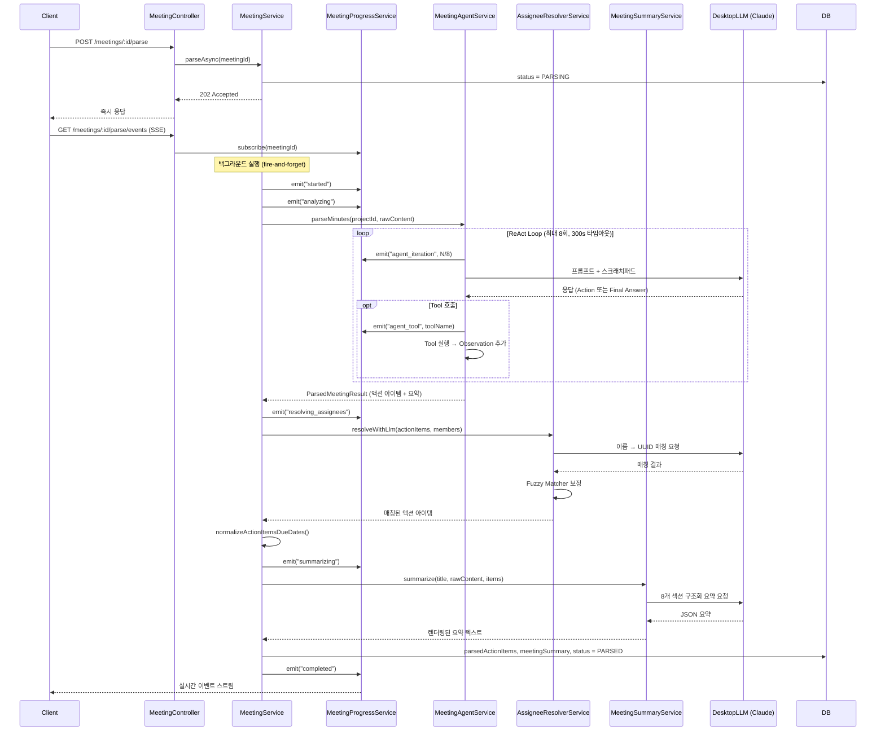
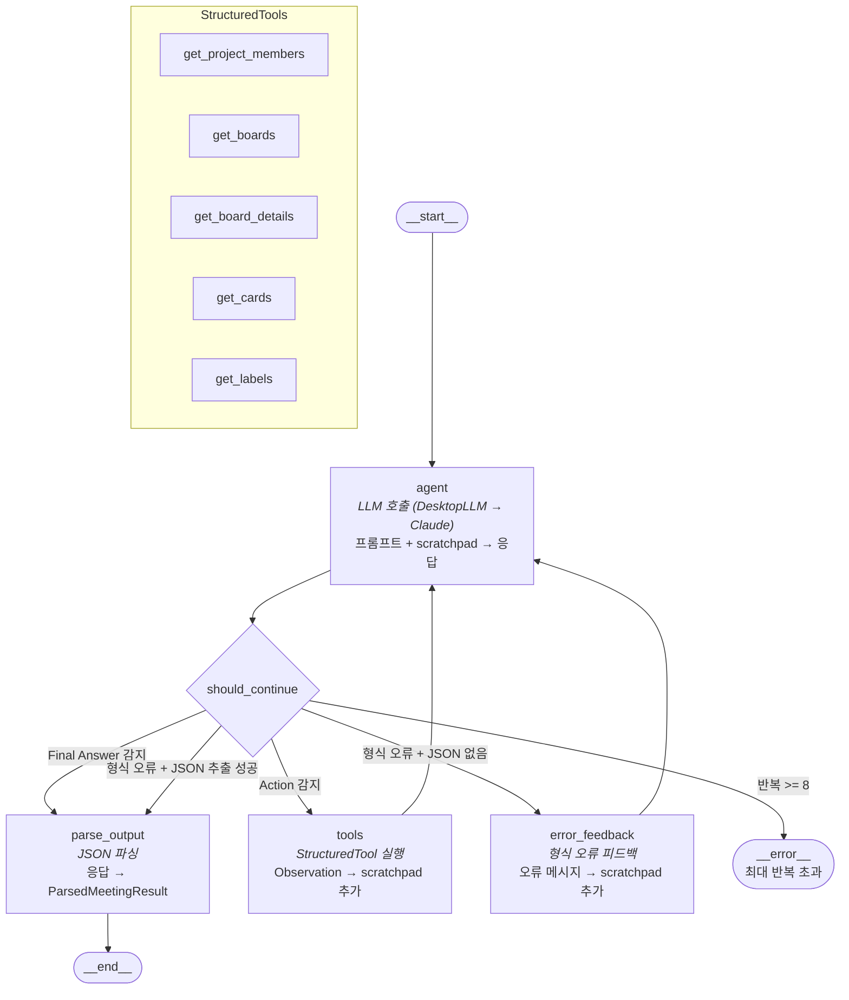
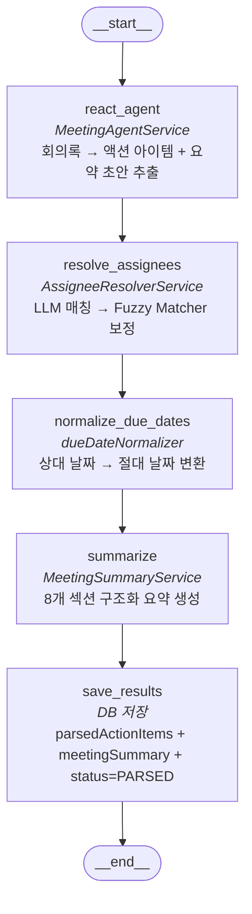

# Gritpus Stela

회의록 기반 프로젝트 관리 도구. 매주 회의록에서 AI가 액션 플랜을 추출하고, 칸반 보드로 관리한다.

## 사전 요구사항

- **Node.js** >= 22.0.0
- **pnpm** 10.x
- **Docker** (MySQL 컨테이너 실행용)

## 프로젝트 구조

```
apps/
  web/      — 프론트엔드 (Next.js 15, Tailwind CSS, shadcn/ui)     :50001
  server/   — 백엔드 API (NestJS 11, TypeORM, MySQL)               :50002
  desktop/  — Claude CLI 래퍼 서비스 (Node.js HTTP)                 :50004
packages/
  shared/   — 공유 TypeScript 인터페이스
infra/      — Docker Compose, Traefik, Dockerfile
```

## 로컬 환경 설정

### 1. 의존성 설치

```bash
pnpm install
```

### 2. MySQL 실행

Docker Compose로 MySQL 8.4 컨테이너를 실행한다. (포트: `50003`)

```bash
pnpm docker:dev
```

### 3. 환경 변수 설정

각 앱의 `.env.example`을 복사하여 `.env` 파일을 만든다.

```bash
cp apps/server/.env.example apps/server/.env
cp apps/web/.env.example apps/web/.env
```

**server** (`apps/server/.env`)

| 변수 | 기본값 | 설명 |
|---|---|---|
| `PORT` | `50002` | 서버 포트 |
| `DB_HOST` | `localhost` | MySQL 호스트 |
| `DB_PORT` | `50003` | MySQL 포트 |
| `DB_DATABASE` | `gritpus` | DB 이름 |
| `DB_USERNAME` | `gritpus` | DB 사용자 |
| `DB_PASSWORD` | `gritpuspassword` | DB 비밀번호 |
| `JWT_SECRET` | `dev-secret-change-me` | JWT 시크릿 |
| `DESKTOP_SERVICE_URL` | `http://localhost:50004` | Desktop 서비스 URL |

**web** (`apps/web/.env`)

| 변수 | 기본값 | 설명 |
|---|---|---|
| `NEXT_PUBLIC_API_URL` | `http://localhost:50002` | API 서버 주소 |

### 4. 개발 서버 실행

각 앱을 별도 터미널에서 실행한다.

```bash
pnpm dev:server    # 백엔드 API  → http://localhost:50002
pnpm dev:web       # 프론트엔드   → http://localhost:50001
pnpm dev:desktop   # Desktop 서비스 → http://localhost:50004
```

> DB 마이그레이션은 서버 시작 시 자동 실행된다 (`migrationsRun: true`).

## 주요 명령어

| 명령어 | 설명 |
|---|---|
| `pnpm dev:server` | 서버 개발 모드 실행 |
| `pnpm dev:web` | 웹 개발 모드 실행 |
| `pnpm dev:desktop` | 데스크톱 서비스 실행 |
| `pnpm build` | 전체 빌드 |
| `pnpm lint` | 전체 린트 |
| `pnpm docker:dev` | MySQL 컨테이너 실행 |
| `pnpm docker:dev:down` | MySQL 컨테이너 중지 |
| `pnpm --filter @gritpus-stela/web generate` | API 클라이언트 자동 생성 (서버 실행 필요) |

## 회의록 AI 파싱 아키텍처

회의록 원문에서 액션 아이템을 추출하고, 담당자를 매칭하고, 요약을 생성하는 파이프라인이다.

### 전체 흐름



### ReAct Agent 그래프

LangGraph 노드/엣지 구조. 커스텀 ReAct 루프로 구현되어 있다.



### 파싱 파이프라인 그래프

전체 파싱은 순차 노드 체인으로 구성된다.



### 타임아웃 설정

| 단계 | 타임아웃 | 실패 시 |
|------|----------|---------|
| Agent 전체 | 300초 | 에러 발생, status = FAILED |
| LLM 호출 (Agent) | 180초 | 에러 전파 |
| 담당자 매칭 LLM | 90초 | Fuzzy Matcher로 폴백 |
| 회의 요약 LLM | 120초 | 기본 요약 텍스트 생성 |
